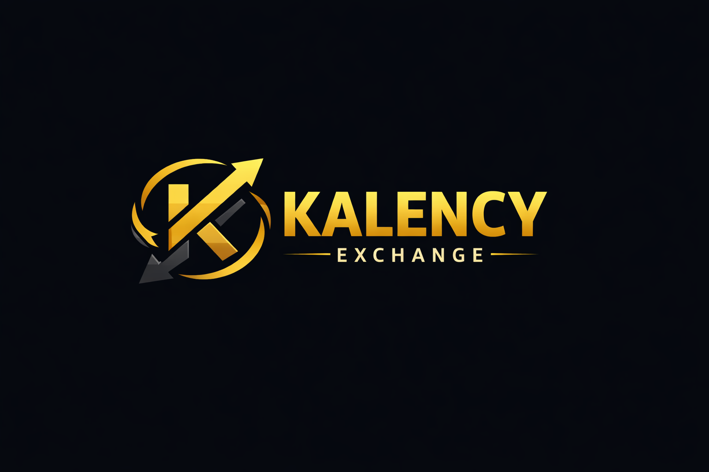

# Kalency

<p align="center">
  
</p>

<p align="center">
  <strong>Event-driven crypto market simulation platform</strong><br/>
  Redis Streams + Go services + Next.js trading UI
</p>

## Overview

Kalency is a multi-service trading simulation project built for learning and production-style architecture practice.
It models a small exchange stack with:

- real-time market tick generation,
- order matching and execution flow,
- candle aggregation from streaming ticks,
- ledger persistence for executed trades,
- a web client for charting and interaction.

The system is split into focused services so each part is easy to reason about, test, and evolve.

## Apps In This Repository

| App | Path | Purpose | Tech |
| --- | --- | --- | --- |
| Gateway API | `apps/gateway-api` | Main API surface, auth, orchestration, WebSocket trade stream | Go + Fiber |
| Matching Engine | `apps/matching-engine` | Order book, matching logic, risk checks, execution generation | Go |
| Market Simulator | `apps/market-sim` | Synthetic market tick generation with runtime controls | Go |
| Candle Aggregator | `apps/candle-aggregator` | Consumes tick stream, builds OHLCV candles by timeframe | Go + Redis |
| Ledger Writer | `apps/ledger-writer` | Persists execution events into PostgreSQL ledger | Go + PostgreSQL |
| Web App | `apps/web` | Trading UI, charting, and exchange interaction | Next.js + TypeScript |

## How The System Flows

1. `market-sim` publishes ticks to Redis Streams.
2. `candle-aggregator` reads ticks and writes candle rollups.
3. `matching-engine` processes orders and emits executions.
4. `ledger-writer` consumes executions and stores them in PostgreSQL.
5. `gateway-api` exposes a unified API for the web client.
6. `web` renders charts, orders, wallet, and market data.

## Quick Start

### Run with Docker Compose

```bash
make up
```

Then open:

- Web UI: `http://localhost:3000`

Useful commands:

- `make down`
- `make logs`
- `make ps`
- `make config`

## Docs

- App implementation notes: `apps/README.md`
- Kalency v1 architecture index: `docs/kalency-v1/README.md`
- Redis learning notes: `docs/learn-redis/`

## Repository Layout

```text
.
├── apps/                # Services and web app
├── assets/              # Branding assets (logo)
├── docker/              # Compose and infra helpers
├── docs/                # Architecture plans and learning docs
└── Makefile             # Common local commands
```
